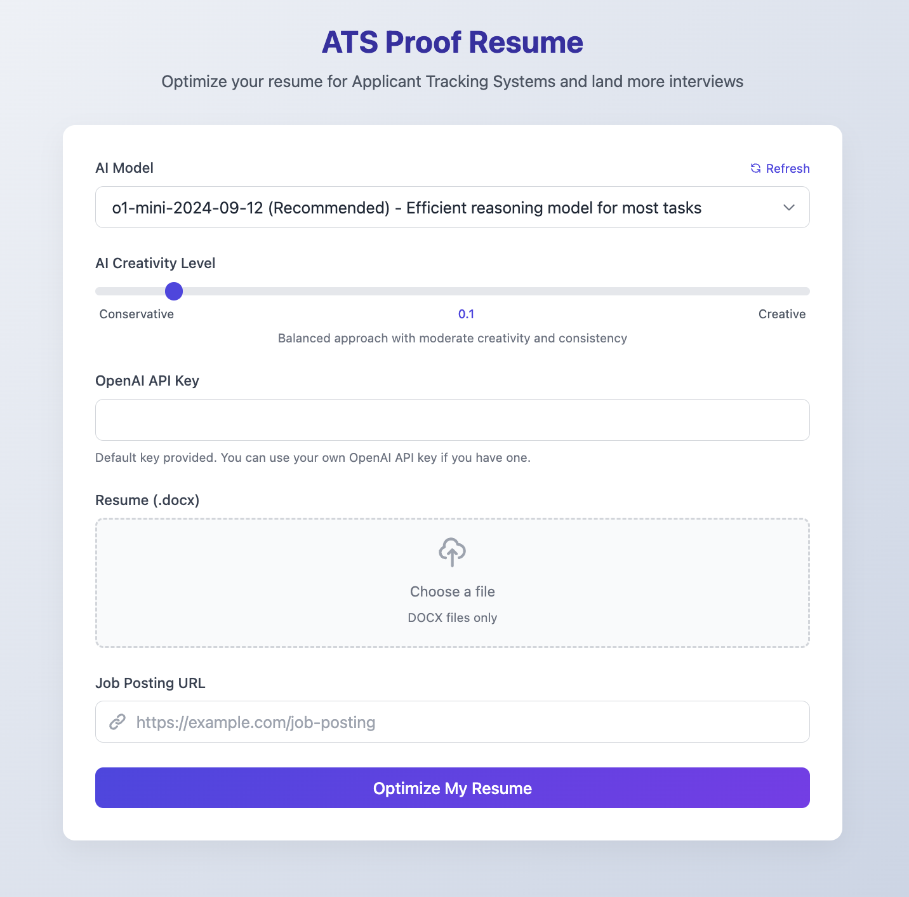
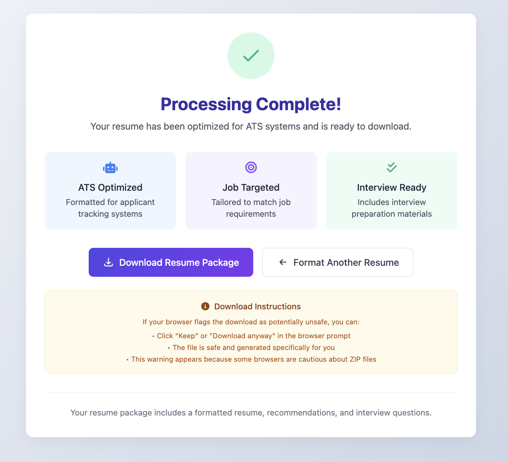

# ATS-Proof Resume Generator

**Transform your job application game. Forever.**

An AI-powered tool that doesn't just optimize your resume—it weaponizes it against Applicant Tracking Systems (ATS) to ensure you get past the digital gatekeepers and into human hands.

> "The difference between a good resume and a great one isn't just content—it's strategic alignment with what machines and humans are looking for."

## What This Tool Actually Does

- **Job Posting Analysis**: Extracts the critical signals from job descriptions that most candidates miss
- **Resume Optimization**: Restructures your experience to mirror exactly what employers want to see
- **ATS-Friendly Formatting**: Implements the hidden formatting rules that make your resume machine-readable
- **Personalized Recommendations**: Provides tactical suggestions that close the gap between you and the ideal candidate
- **Interview Question Generator**: Creates custom questions that let you control the conversation during interviews

## The Technical Requirements

- Python 3.8 or higher
- OpenAI API key (for the AI-powered features)
- Chrome/Chromium (for capturing job posting screenshots)

### Generating an OpenAI API Key

To use the AI-powered features of this tool, you need an OpenAI API key. Follow these steps to generate your API key:

1. Visit the [OpenAI Quickstart Guide](https://platform.openai.com/docs/quickstart).
2. Sign in or create an OpenAI account.
3. Navigate to the API section in your account dashboard.
4. Generate a new API key and keep it secure.

Once you have your API key, you can set it as an environment variable or enter it directly in the application interface.

## Installation Options

### Option 1: One-Command Setup (Recommended)

The fastest path from zero to running:

1. Clone this repository:
   ```
   git clone https://github.com/yourusername/ats-proof-resume.git
   cd ats-proof-resume
   ```

2. Run the setup script:
   ```
   chmod +x run.sh
   ./run.sh
   ```

   This will:
   - Create a virtual environment
   - Install all dependencies
   - Start the application

3. Open your browser and navigate to:
   ```
   http://localhost:8000
   ```

### Option 2: Manual Setup

If you prefer control over each step:

1. Create a virtual environment:
   ```
   python -m venv venv
   source venv/bin/activate  # On Windows: venv\Scripts\activate
   ```

2. Install dependencies:
   ```
   pip install -r requirements.txt
   ```

3. Run the application:
   ```
   uvicorn app.main:app --reload
   ```

### Option 3: Docker Deployment

For a completely isolated, reproducible environment:

1. Make sure Docker and Docker Compose are installed
2. Build and run with Docker Compose:
   ```
   docker-compose up --build
   ```

This setup includes:
- A Selenium container for handling web scraping
- The main application container
- Proper networking between containers
- Volume mounting for the output directory

### Option 4: Docker with ARM64 Architecture (M1/M2 Macs)

If you're running on an ARM-based machine like an M1/M2 Mac:

1. The Docker setup is configured to handle ARM64 architecture automatically
2. The application uses a remote Selenium WebDriver to avoid compatibility issues
3. No additional configuration is needed - just run:
   ```
   docker-compose up --build
   ```

## How to Actually Use This Tool

1. Enter your OpenAI API key (if not set as an environment variable)
2. Paste the URL of the job posting you're targeting
3. Upload your current resume (DOCX format only)
4. Select the AI model and parameters (see model recommendations below)
5. Click "Generate ATS-Proof Resume"
6. Download your weaponized resume package

## Model Selection Guide

The choice of LLM model significantly impacts your results. After extensive testing:

- **o1-mini-2024-09-12**: Offers the best balance of performance and cost. Handles complex resume restructuring with excellent accuracy while being more cost-effective than GPT-4o.
- **gpt-4o**: Provides more creative rewrites with excellent comprehension of complex career histories, but at a higher cost (approximately 5-10x more expensive than o1-mini).
- **gpt-3.5-turbo**: Most economical option, acceptable for basic resumes but may struggle with complex career histories or nuanced job requirements.

For most users, **o1-mini** is the recommended choice as it delivers high-quality results at a reasonable cost.

**Temperature Setting**: The application allows you to adjust the AI's creativity level:
- Lower values (0.1-0.3): More conservative, consistent outputs
- Medium values (0.4-0.6): Balanced approach with moderate creativity
- Higher values (0.7+): More creative variations but potentially less consistent

**Important**: The application processes your entire resume in a single LLM call. This approach works well with modern models but may hit token limits with extremely lengthy resumes (10+ pages).

## User Interface

### Landing Page



The landing page features a clean, intuitive interface with the following components:

1. **AI Model Selection**: A dropdown menu allowing you to choose from various OpenAI models, with recommendations highlighted.
2. **Creativity Level Slider**: Adjust the temperature parameter to control how creative or conservative the AI's output will be.
3. **API Key Field**: Enter your OpenAI API key (a default key is provided for convenience).
4. **Resume Upload**: A drag-and-drop area to upload your DOCX resume file.
5. **Job Posting URL**: Enter the URL of the job posting you're targeting.

The interface is designed to be straightforward while giving you control over the key parameters that affect your resume optimization. The page also includes helpful tooltips and descriptions to guide your choices.

### Results Page



After processing your resume, you'll be presented with a results page that includes:

1. **Success Confirmation**: A visual indicator that your resume has been successfully processed.
2. **Feature Cards**: Three cards highlighting the key optimizations made to your resume:
   - ATS Optimization: Formatting changes to make your resume readable by applicant tracking systems
   - Job Targeting: Tailoring to match the specific job requirements
   - Interview Preparation: Materials to help you prepare for interviews

3. **Download Button**: A prominent button to download your complete resume package.
4. **Start Over Option**: A button to return to the landing page and process another resume.
5. **Download Instructions**: Helpful tips about handling any browser security warnings when downloading the ZIP file.

The results page is designed to clearly communicate the value of the optimizations made to your resume while making it easy to access your new resume package.

## Resume Format Requirements

The system uses a specific tag-based format for processing resumes. The AI model is instructed to output in this format to ensure proper parsing and document generation.

### Example of Correct Format:
```xml
<NAME>
John Smith

<CONTACT>
john.smith@example.com | linkedin.com/in/johnsmith | (555) 123-4567 | San Francisco, CA

<SUMMARY>
Experienced software engineer with 5+ years specializing in cloud infrastructure and distributed systems...

<SKILLS>
Cloud Architecture | CI/CD Pipelines | Kubernetes | Docker | Python | JavaScript

<EXPERIENCE>
<COMPANY>
Tech Innovations Inc. | San Francisco, CA

<POSITION_DATE>
Senior Software Engineer | 01/2020 – Present

<BULLET>
Infrastructure: Redesigned microservice architecture reducing latency by 40%

<BULLET>
Leadership: Led team of 5 engineers in developing new payment processing system

<COMPANY>
Previous Company | Location

<POSITION_DATE>
Software Developer | 03/2017 – 12/2019

<BULLET>
Development: Created responsive web application increasing user engagement by 25%

<EDUCATION>
University of Technology | San Francisco, CA
Bachelor of Science in Computer Science – Cum Laude
GPA 3.8/4.0 | 08/2013 – 05/2017

<VOLUNTEERISM>
Code for Good | 06/2018 – Present
Volunteer developer for nonprofit organizations

<OTHER RELEVANT INFORMATION>
Languages: English (Native), Spanish (Conversational)
```

### Final Resume Formatting

The system transforms the tagged format into a professionally formatted DOCX file with:

1. **Clean, ATS-Friendly Layout**: Optimized for both human readers and applicant tracking systems
2. **Consistent Typography**: Professional font choices with proper hierarchy
3. **Strategic Whitespace**: Balanced spacing for improved readability
4. **Bullet Point Optimization**: Achievement-focused bullet points with action verbs
5. **Keyword Integration**: Strategic placement of job-relevant keywords
6. **Section Organization**: Logical flow of information prioritizing relevant experience

The final document follows best practices for modern resume design while maintaining compatibility with ATS systems that many employers use to screen candidates.

### Example Transformation

For a real-world example of how the system transforms resumes, see this [sample SysAdmin/Cloud resume from Reddit](https://www.reddit.com/r/resumes/comments/cs93cu/resume_for_sysadmin_cloud_etc_positions/). The system would analyze this resume, identify improvement opportunities, and restructure it to highlight relevant skills and achievements for the target position.

### Troubleshooting Format Issues:

If you encounter format problems:
- **Try a different model**: The `o1-mini` model tends to follow formatting instructions most consistently
- **Lower the temperature**: Reduce the temperature setting to 0.1-0.3 for more deterministic outputs
- **Check your original resume**: Ensure your original resume is properly formatted in the DOCX file
- **Review application logs**: Check the logs for specific error messages about format validation
- **Simplify complex resumes**: Very complex resume structures might need simplification

The system includes built-in retry logic - if processing fails after multiple attempts, you'll receive an error notification and can try again with different settings.

### Course Connection

This tool was inspired by the [Modern Job Application Mastery course](https://courses.eazl.co/courses/438780/lectures/6728683), which teaches a powerful methodology for resume optimization:

1. **Extract Key Skills**: Analyze job descriptions to identify 6-8 critical skills or competencies that employers are seeking
2. **Map Skills to Experience**: Systematically rewrite each work experience bullet point to demonstrate these specific skills
3. **Use Employer Language**: Mirror the exact terminology and phrasing from the job description
4. **Quantify Achievements**: Add metrics and specific results to validate your proficiency in each skill area
5. **Prioritize Relevance**: Reorganize content to highlight the most relevant skills for the specific position

This methodology is the foundation of our AI-powered resume optimization. The system automatically extracts the key skills from job descriptions and restructures your resume to demonstrate these skills through your past experiences, creating a targeted document that speaks directly to what employers are looking for.

For example, if a job description emphasizes "cloud infrastructure management," "team leadership," and "cost optimization," the system will identify these skills and rewrite your experience bullets to highlight specific instances where you've demonstrated these competencies, using language that resonates with ATS systems and hiring managers alike.

For maximum results, use this tool alongside the course materials to develop a comprehensive job application strategy that goes beyond just resume optimization.

## Environment Variables

- `OPENAI_API_KEY`: Your OpenAI API key (optional, can be provided in the UI)
- `SELENIUM_REMOTE_URL`: URL for remote Selenium WebDriver (used in Docker setup)
- `SE_DISABLE_MANAGER`: Disables Selenium Manager to use system-installed ChromeDriver

## Advanced Usage: Running Options Explained

The `run.sh` script provides several execution modes:

### Standard Mode
```
./run.sh
```

Creates a Python virtual environment, installs dependencies, and runs the application locally.

### Testing Mode
```
./run.sh --test
```

Verifies all dependencies are correctly installed without starting the application.

### Docker Mode
```
./run.sh --docker
```

Builds and runs the application in a Docker container, providing complete isolation from your system.

### Help Mode
```
./run.sh --help
```

Displays available options and usage information.

## Troubleshooting Docker Issues

### ARM64 Architecture (M1/M2 Macs)

The application is configured to work on ARM64 architecture using:
- A Selenium container specifically designed for ARM64
- Remote WebDriver configuration to avoid compatibility issues
- Platform-specific settings in docker-compose.yml

### Chrome/Selenium Issues

If you encounter Chrome or Selenium-related errors:
1. Make sure both containers are running: `docker-compose ps`
2. Check the Selenium container logs: `docker-compose logs selenium`
3. Verify the SELENIUM_REMOTE_URL environment variable is set correctly
4. Try rebuilding both containers: `docker-compose down && docker-compose up --build`

### Resume Processing Errors

If you see "Resume rewriting failed" errors:
1. Check that your OpenAI API key is valid and has sufficient credits
2. Verify your resume is in a valid DOCX format
3. Try a different model or reduce the temperature setting
4. Check the application logs for detailed error messages

## Troubleshooting Chrome/Selenium Issues in Docker

### DevToolsActivePort File Error

If you see an error like this in your logs:
```
Failed to capture screenshot: Message: unknown error: Chrome failed to start: exited abnormally.
(unknown error: DevToolsActivePort file doesn't exist)
(The process started from chrome location /usr/bin/chromium is no longer running, so ChromeDriver is assuming that Chrome has crashed.)
```

This is a common issue when running Chrome in Docker containers. Here's how to fix it:

#### Solution 1: Update Chrome Options

Modify the `job_scraper.py` file to add these additional Chrome options:

```python
chrome_options.add_argument("--no-sandbox")
chrome_options.add_argument("--disable-dev-shm-usage")
chrome_options.add_argument("--disable-gpu")
chrome_options.add_argument("--disable-extensions")
chrome_options.add_argument("--disable-dev-tools")
chrome_options.add_argument("--remote-debugging-port=9222")
```

#### Solution 2: Use the Selenium Container

The application is configured to use a separate Selenium container when running with Docker Compose. Make sure:

1. Both containers are running:
   ```bash
   docker-compose ps
   ```

2. The environment variable is set correctly in docker-compose.yml:
   ```yaml
   environment:
     - SELENIUM_REMOTE_URL=http://selenium:4444/wd/hub
   ```

3. The Selenium container has enough shared memory:
   ```yaml
   shm_size: 2g
   ```

#### Solution 3: Rebuild with Updated Docker Configuration

If you've made changes to fix the issue:

```bash
docker-compose down
docker-compose up --build
```

#### Solution 4: Check for ARM64 Compatibility

If you're running on an ARM-based system (like M1/M2 Mac):

1. Make sure you're using the ARM-compatible Selenium image:
   ```yaml
   selenium:
     image: seleniarm/standalone-chromium:latest
   ```

2. Set the platform for your app container:
   ```yaml
   app:
     platform: linux/amd64
   ```

The application is designed to fall back to creating a placeholder image when screenshot capture fails, so your resume processing should still work even if screenshots cannot be captured.

## The Philosophy Behind This Tool

Most resume tools focus on cosmetic improvements. This one doesn't.

This tool operates on the principle that modern job applications are a two-audience game: you need to satisfy both the algorithm and the human. By analyzing the specific language patterns in job descriptions and restructuring your experience to match, you're not just "keyword stuffing"—you're translating your value into the exact dialect the employer speaks.

The difference is subtle but critical.

## Final Thoughts

Your resume isn't just a document—it's the most important piece of marketing you'll ever create for yourself.

Use this tool not as a magic bullet, but as a strategic advantage in a game where most people don't even know the rules. The difference between getting filtered out and getting called back often comes down to how well you speak the language of both the machines and the humans who make hiring decisions.

---

## For Developers: Project Structure

```
ats-proof-resume/
├── app/                  # Main application code
│   ├── __init__.py
│   ├── main.py           # FastAPI application entry point
│   ├── routes.py         # API endpoints
│   ├── state.py          # Application state management
│   ├── tasks.py          # Background processing tasks
│   ├── services.py       # Service functions for model management
│   ├── caching.py        # Cashing Custom Decorators
│   └── utils.py          # Utility functions
├── resume/               # Resume processing logic
│   ├── __init__.py
│   ├── formatter.py
│   ├── parser.py
│   ├── writer.py
│   └── processor.py      # AI-powered resume optimization
├── templates/            # HTML templates for the web interface
│   ├── result.html
│   └── index.html        # Landing page template
├── docs/                 # Documentation assets
│   └── images/           # Screenshots and diagrams
├── tests/ # Test suite
│   ├── init.py
│   ├── mocks.py # Mock objects for testing
│   ├── test_app_main.py # Tests for main application
│   ├── test_app_routes.py # Tests for app routes
│   └── test_app_tasks.py # Tests for app tasks
├── docker_files/         # Docker-specific utilities
│   ├── docker_pillow_fix.py    # Fix for Pillow in Docker
│   ├── docker_fix.py           # Fix to work in Docker on ARM64 architecture.
│   ├── docker_selenium_fix.py  # Fix for Selenium in Docker
│   └── job_scraper_docker.py   # Docker-compatible version of the job_scraper.py
├── job_scraper.py        # Job posting scraping functionality
├── interview_questions.py # Interview question generation
├── recommendations.py    # Personalized recommendation generation
├── Dockerfile            # Main Docker configuration
├── Dockerfile.selenium   # Selenium-specific Docker configuration
├── docker-compose.yml    # Multi-container Docker setup
├── setup.py              # Package installation configuration
├── requirements.txt      # Python dependencies
├── run.sh                # Main execution script
├── test_deps.py          # Dependency testing script
└── test_imports.py       # Import verification script
```

## Contributing

Contributions that push the boundaries of what's possible in modern job applications are welcome. Before submitting a PR:

- Ensure your code follows the project's style guidelines
- Add tests for new functionality
- Update documentation to reflect your changes

## License

This project is licensed under the MIT License - see the LICENSE file for details.
